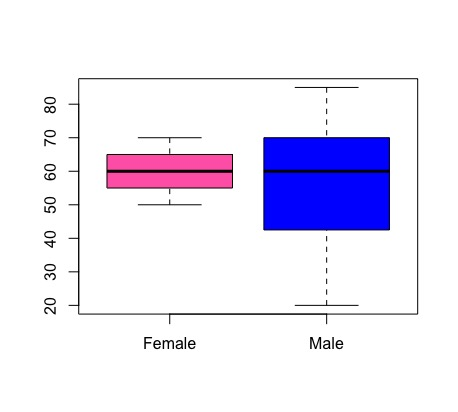
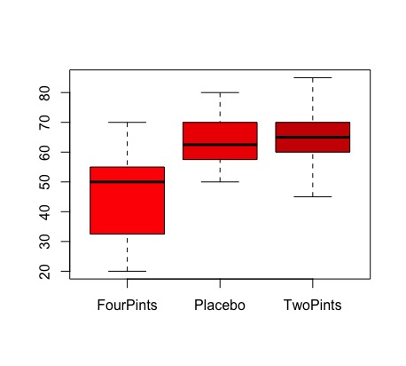
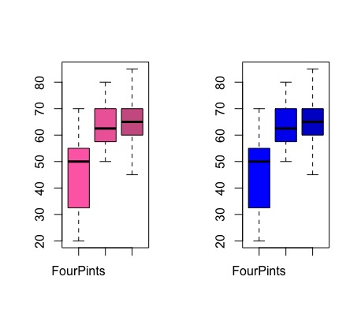
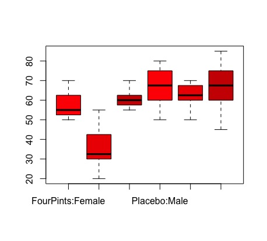

# The-Beer-Goggles-Effect
Two Way Independent ANOVA

A two way independent is used when two independent variables have been manipulated using different participants inn all conditions.

In this repo, we are trying to find out effects of alcohol on mate selection during a night out. It is assumed that the percepion of attractiveness becomes not so accurate after few drinking sessions.

We can see that with placebo drink, both males and females choose a high percentage of attractive mate.

## Running this

- Make sure you have R installed
- Open the file in R studio 
- Run the script

### Correlating effect of gender on mate selection

---------------------------------------------------------
### Correlating alcohol consumption and Attractiveness of Date

This indicates a person is willing to accept less attractive mate after 4 pints

---------------------------------------------------------
### Alcohol consumption and Attractiveness of date in females and males subset

---------------------------------------------------------
### Interaction effect

 Statiscally, when males drink too much, in this case 4 pints, they mate with unattractive mates
 
 ---------------------------------------------------------
 Source: http://www.discoveringstatistics.com/docs/twoway.pdf
